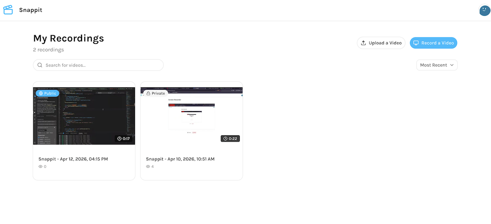

# 🎥 Snappit



Snappit is a powerful, full-stack screen recording and video hosting platform. It features a modern Next.js web application and a companion Chrome Extension (Manifest V3) that allows users to record their screen, tab, or window seamlessly from anywhere on the web.

Recorded videos are safely buffered using IndexedDB and ArrayBuffers to handle massive files without memory crashes, and are effortlessly synced to the web app for uploading, playback, and sharing.

---

## ✨ Features

### Web Application

- **Screen Recording:** Native screen, window, and tab capturing using the `MediaDevices` API.
- **Custom Video Player:** A bespoke native HTML5 video player featuring custom controls, picture-in-picture, playback speed, skip forward/backward, and keyboard shortcuts.
- **Secure Authentication:** Seamless Google OAuth login powered by Better Auth.
- **Robust Upload Pipeline:** Large file handling with drag-and-drop support, automatic thumbnail generation, and metadata extraction.
- **Modern UI:** Beautiful, responsive, and accessible interface built with Tailwind CSS, Radix UI (Shadcn), and Lucide icons.

### Chrome Extension

- **Record Anywhere:** Initiate screen recordings from any browser tab without keeping the Snappit web app open.
- **Manifest V3 Architecture:** Utilizes Offscreen Documents to securely record media in the background.
- **Cross-Origin Syncing:** Securely transfers massive video blobs from the extension's isolated environment directly into the web app's IndexedDB via Content Scripts.
- **Authentication Aware:** Reads HTTP-only session cookies to ensure only authenticated users can initiate recordings.

---

## 🛠️ Tech Stack

**Frontend (Web):**

- Next.js (App Router)
- React
- Tailwind CSS
- Shadcn UI
- React Hook Form + Zod

**Backend & Data:**

- Drizzle ORM
- PostgreSQL
- Better Auth
- AWS S3 and CloudFront

**Extension:**

- Chrome Extension API (Manifest V3)
- Background Service Workers & Offscreen Documents
- Chrome Messaging & Content Scripts

---

## Monorepo and video processing

The Next.js app sends events from Vercel. It does not run Inngest Connect. The video worker runs as a long-lived Docker container on the VPS and establishes the outbound Inngest Connect connection.

The web app lives in `apps/web`, the worker in `apps/video-worker`, and shared database, event, validation and storage code in `packages`. The Chrome extension remains in `extension`.

Read [video worker operations](docs/video-worker.md) for local development, the additive database prerequisite, Vercel root settings, VPS deployment, environment variables, cutover and rollback. Production migrations should follow your established Drizzle history; use `db:push` below only for a fresh development database.

## 🚀 Getting Started

### Prerequisites

- **Node.js** (v22.4 or higher), **pnpm 10.28.0**
- **PostgreSQL** database (local or hosted, e.g., Supabase/Neon)

### 1. Fork and Clone the Repository

```bash
git clone https://github.com/aadi-thedevguy/snappit.git
cd snappit
```

### 2. Install Dependencies

```bash
corepack enable
pnpm install --frozen-lockfile
```

### 3. Environment Variables

Copy `apps/web/.env.example` to `apps/web/.env` and add the required variables.
_Follow these docs for AWS cloudfront and s3 setup_
[https://github.com/aws-samples/amazon-cloudfront-signed-urls-using-lambda-secretsmanager/tree/main/1-Create_S3_Bucket](https://github.com/aws-samples/amazon-cloudfront-signed-urls-using-lambda-secretsmanager/tree/main/1-Create_S3_Bucket)

_(Note: Ensure your Google OAuth credentials have `http://localhost:3000/api/auth/callback/google` added to the Authorized redirect URIs)._

### 4. Setup the Database

For a disposable local database, push the current schema:

```bash
pnpm db:push
```

For shared or production databases, use generated migrations instead:

```bash
# create SQL from schema changes; review the generated file
pnpm db:generate

# apply pending SQL migrations once
pnpm db:migrate
```

`drizzle-kit migrate` creates the `__drizzle_migrations` bookkeeping table if it does not exist, then records each applied migration in it. PostgreSQL may print `42P07 relation "__drizzle_migrations" already exists, skipping` as a `NOTICE` when that table is already present. This is informational and means the bookkeeping table is being reused; it is not an error. A successful run continues with `migrations applied` or exits with code 0. Do not delete this table or rerun old SQL manually. If a migration fails, fix the SQL or database state, then rerun `pnpm db:migrate`; completed migrations are skipped using the journal.

The repository's `drizzle.config.ts` loads `apps/web/.env`, so `DATABASE_URL` must point to the intended database before running these commands. Review generated SQL before applying it, especially changes involving existing production columns or data.

### 5. Run the Web Application

```bash
pnpm dev:web
```

The app should now be running on http://localhost:3000.

---

## 🧩 Chrome Extension Setup (Local Development)

To test the Chrome Extension locally and sync it with your local Next.js environment:

1. Open your Chromium browser and navigate to `chrome://extensions/`.
2. Enable **Developer mode** (toggle in the top right corner).
3. Click **Load unpacked** in the top left corner.
4. Select the `extension/` folder located inside the `snappit` repository.
5. Open the `extension/background.js` and `extension/popup.js` files and ensure `APP_URL` is set to `http://localhost:3000` (comment out the production URL during local development).
6. Click the extension's **Reload** icon on the `chrome://extensions/` page to apply changes.

---

## 🤝 Contributing

Contributions are highly welcome! If you'd like to improve Snappit:

1. Fork the project.
2. Create your feature branch (`git checkout -b feature/AmazingFeature`).
3. Commit your changes (`git commit -m 'Add some AmazingFeature'`).
4. Push to the branch (`git push origin feature/AmazingFeature`).
5. Open a Pull Request.

---

## 📝 License

Distributed under the MIT License. See `LICENSE` for more information.

## TODO

- Add the abandoned recording cleanup workflow through n8n. The application does not schedule a Vercel cron for this.
